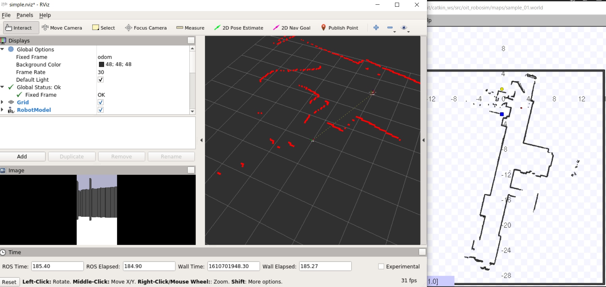
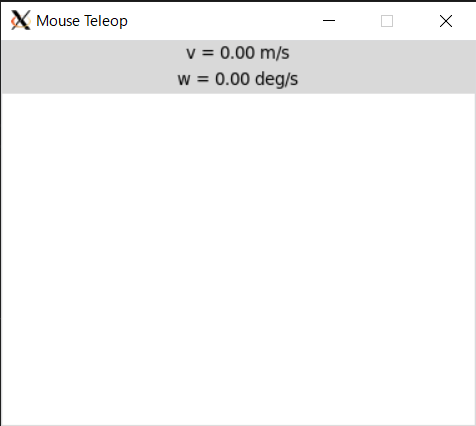
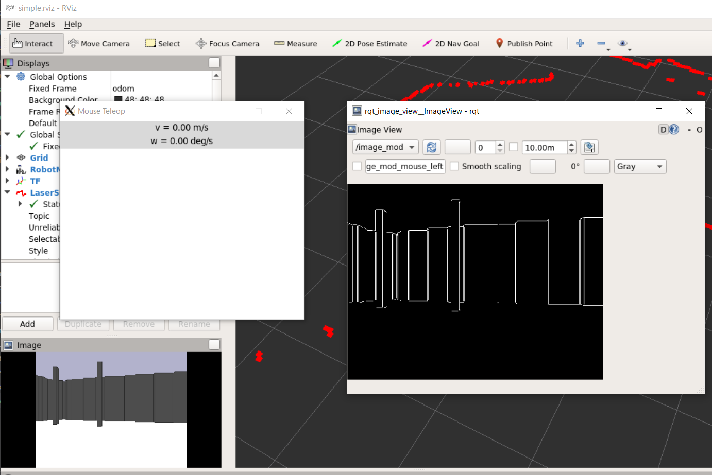
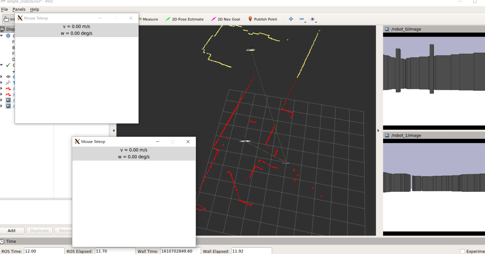
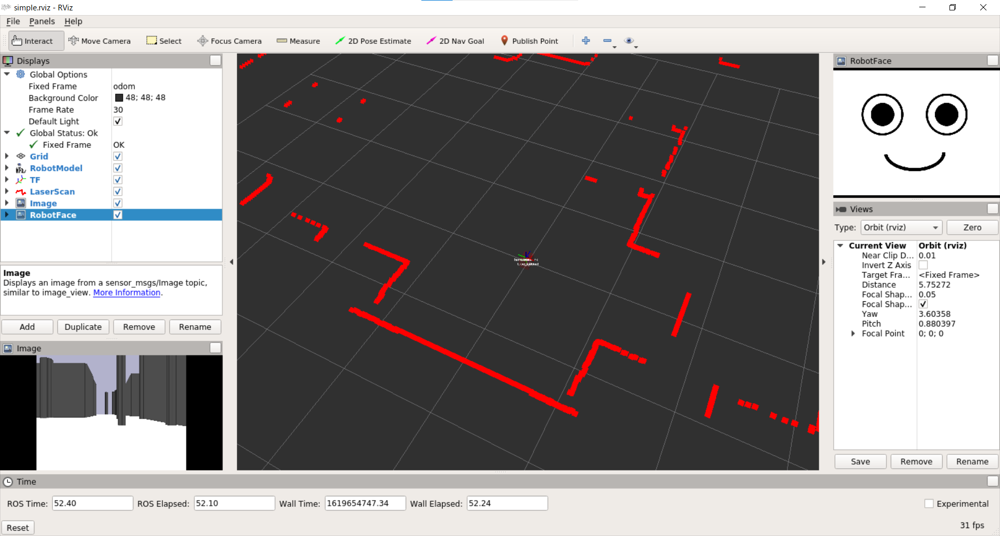

# oit_stage_ros

[stage_ros](http://wiki.ros.org/stage_ros)を使ったシミュレータ。

## インストール

```shell
$ cd ~/catkin_ws/src
$ git clone https://github.com/KMiyawaki/oit_stage_ros.git
$ git clone https://github.com/KMiyawaki/oit_pbl_maps.git
```

## ロボット一台のシミュレーションデモ

### シンプルなマウステレオペ

```shell
$ roslaunch oit_stage_ros simple.launch
```

RViz と[stage](https://player-stage-manual.readthedocs.io/en/latest/)、[mouse_teleop](https://github.com/ros-teleop/teleop_tools)が起動する。



`mouse_teleop`のウィンドウ内をドラッグするとロボットが動く。



`roslaunch`を実行した端末で`Ctrl＋C`で全プログラムを終了させる。`mouse_teleop`のウィンドウだけは閉じるボタンで終了させる。

### 地図作成

```shell
$ roslaunch oit_stage_ros mapping.launch 
```

前項と同じように`mouse_teleop`のウィンドウ内をドラッグするとロボットが動き、地図が作成される。

### ナビゲーション

```shell
$ roslaunch oit_stage_ros navigation.launch 
```

操作方法は[ロボットのナビゲーション](https://github.com/KMiyawaki/lectures/blob/master/ros/stage_simulator/stage_simulator_01.md#%E3%83%AD%E3%83%9C%E3%83%83%E3%83%88%E3%81%AE%E3%83%8A%E3%83%93%E3%82%B2%E3%83%BC%E3%82%B7%E3%83%A7%E3%83%B3)を参照。

### 画像処理

```shell
$ roslaunch oit_stage_ros simple.launch 
```

を実行後、別端末で以下を実行する。

```shell
$ roslaunch oit_stage_ros image_proc_sample.launch
```



RViz 等に加えて[rqt_image_view](http://wiki.ros.org/rqt_image_view)が開く。`rqt_image_view`に何も表示されていない場合はトピック名選択のドロップボックスから`image_mod`を選ぶ。

実際の画像処理プログラムは`scripts/imaeg_proc_sample.py`にある。

## ロボット二台のシミュレーションデモ

```shell
$ roslaunch oit_stage_ros simple_2robots.launch
```



２台のロボットとそれぞれの`mouse_teleop`ウィンドウが開き、マウスでロボットを操作できる。

以下のコマンドで`pub/sub`によるロボットの制御ができる。つまりプログラムでコントロールできることを意味する。

```shell
$ rostopic pub /robot_0/cmd_vel geometry_msgs/Twist "linear:
  x: 0.3
  y: 0.0
  z: 0.0
angular:
  x: 0.0
  y: 0.0
  z: 0.0" -r 10
```

`robot_0`を`robot_1`にすれば別のロボットが走る。

## ロボットの表情の表示

1. マウステレオペ、もしくはナビゲーションを起動する。
2. 別ターミナルで`rosrun oit_stage_ros face_image_publisher.py`を実行するとRViz上に表情が表示される。
3. さらに別ターミナルで`rostopic pub /robot_face_type std_msgs/String "data: 'happy'" -1`と実行すると表情の画像が変わる。
    - `'happy'`を`'sad'`や`'normal'`に変えて実行することもできる。



## Windows プログラムとの連携

### Windowsプログラムからロボットをコントロールする

[rosbridge_server](http://wiki.ros.org/rosbridge_server)を使い、WindowsからTCP/IPでROSトピックをパブリッシュする。  
ROSでそのトピックを受信し、データに応じてロボットの速度指令を送信する。  
マウステレオペを起動した状態で以下のコマンドを実行する。

```shell
rosrun oit_stage_ros control_from_win_sample_01.py
```

Windows側では次のリポジトリをクローンしておく。

- [KMiyawaki/win_rosclient_sample](https://github.com/KMiyawaki/win_rosclient_sample.git)

クローンした`win_rosclient_sample/win_rosclient_sample_01.py`を実行し、Windowsターミナルから`forward`、`back`、`left`、`right`などとコマンドを送るとロボットが動く。それ以外の文字列の場合は停止する。

### Windowsプログラムとメッセージを送受信する

WindowsからTCP/IPでROSトピックをパブリッシュする。また、ROSからパブリッシュしたトピックをWindowsで受信する。
Windows側では次のリポジトリをクローンしておく。

- [KMiyawaki/win_rosclient_sample](https://github.com/KMiyawaki/win_rosclient_sample.git)

**ナビゲーション**を起動した状態で以下のコマンドを実行する。

```shell
rosrun oit_stage_ros communication_with_win_sample_01.py
```

5秒以内にWindowsターミナルから`win_rosclient_sample/communication_with_win_sample_01.py`を実行する。  
ロボットは座標`(1.15, 2.42)`に進んだ後、しばらくすると、Windows側ターミナルでROSからパブリッシュされたメッセージを受信する。

```shell
> python communication_with_ros_sample_01.py
{'topic': '/from_ros', 'msg': {'data': 'Hello! this is /communication_with_win_sample_01 0'}, 'op': 'publish'}
...
```

十回メッセージを送信するか20秒たつとWindowsからのメッセージ送信が始まり、ROS側で受信する。

```shell
$ ./communication_with_win_sample_01.py
[INFO] [1619573798.482099, 23.400000]: /communication_with_win_sample_01:Started
[INFO] [1619573814.455466, 39.400000]: Receive from win(0):Hello this is windows 2
[INFO] [1619573815.455155, 40.400000]: Receive from win(1):Hello this is windows 3
...
```

### 複数のWindowsプログラムとメッセージを送受信する

WindowsからTCP/IPでROSトピックをパブリッシュする。また、ROSからパブリッシュしたトピックをWindowsで受信する。  
ただし、Windows側ではプログラムを２つあらかじめ起動しておく。それぞれのWindowsプログラムとの通信に使うトピック名を個別に用意しておことでROS側からどのWindowsプログラムと通信するかを指定できる。
Windows側では次のリポジトリをクローンしておく。

- [KMiyawaki/win_rosclient_sample](https://github.com/KMiyawaki/win_rosclient_sample.git)

1. ROS側で**ナビゲーション**を起動する。
2. Windowsターミナル１で`win_rosclient_sample/play_with_ros_sample_01_a.py`（じゃんけんを模擬したもの）を実行する。
    - トピック`/from_windows_a, /from_ros_a`を使って通信する。
3. Windowsターミナル２で`win_rosclient_sample/play_with_ros_sample_01_b.py`（あっち向いてほいを模擬したもの）を実行する。
    - トピック`/from_windows_b, /from_ros_b`を使って通信する。
4. ROS側で`rosrun oit_stage_ros play_with_win_sample_01.py`を実行する。

ロボットは最初に`win_rosclient_sample/play_with_ros_sample_01_a.py`とメッセージ通信し、じゃんけんを行う。  
その後座標`(1.15, 2.42)`に進んだ後、`win_rosclient_sample/play_with_ros_sample_01_b.py`とメッセージ通信し、あっち向いてほいを行う。  
最後に勝敗結果を表示して終了する。

#### 実行結果

- ROS側

```shell
$ ./play_with_win_sample_01.py
[INFO] [1619591046.363820, 1545.900000]: /play_with_win_sample_01:Started
[INFO] [1619591046.601713, 1546.100000]: /play_with_win_sample_01:The server move_base comes up
[INFO] [1619591051.575134, 1551.100000]: /play_with_win_sample_01:Try to start game A
[INFO] [1619591059.608607, 1559.100000]: /play_with_win_sample_01:Receive from win:Paper
[INFO] [1619591062.596496, 1562.100000]: /play_with_win_sample_01:Robot select 'Paper'
[INFO] [1619591063.650951, 1563.200000]: /play_with_win_sample_01:Receive from win:even
[INFO] [1619591066.694032, 1566.200000]: Ouch!!
[INFO] [1619591066.696585, 1566.200000]: /play_with_win_sample_01:Sending goal
[INFO] [1619591080.765547, 1580.300000]: /play_with_win_sample_01:Finished: (3)
[INFO] [1619591080.770182, 1580.300000]: /play_with_win_sample_01:Try to start game B
[INFO] [1619591088.802443, 1588.300000]: /play_with_win_sample_01:Receive from win:down
[INFO] [1619591091.790219, 1591.300000]: /play_with_win_sample_01:Robot select 'down'
[INFO] [1619591092.847769, 1592.300000]: /play_with_win_sample_01:Receive from win:win
[INFO] [1619591095.896336, 1595.400000]: Yeah!!
[INFO] [1619591095.899165, 1595.400000]: /* GAME RESULTS */
[INFO] [1619591095.902005, 1595.400000]: /* GAME (A):Robot lose */
[INFO] [1619591095.905154, 1595.400000]: /* GAME (B):Robot win */
[INFO] [1619591095.907654, 1595.400000]: /* ------------ */
[INFO] [1619591095.909739, 1595.400000]: /play_with_win_sample_01:Exiting
```

- Windowsじゃんけんプログラム側

```shell
>python play_with_ros_sample_01_a.py
Receive from ROS:Start your game!
Sending ros message: {'op': 'publish', 'topic': '/from_windows_a', 'msg': {'data': 'Paper'}}
Sending ros message: {'op': 'publish', 'topic': '/from_windows_a', 'msg': {'data': 'Paper'}}
Sending ros message: {'op': 'publish', 'topic': '/from_windows_a', 'msg': {'data': 'Paper'}}
Receive from ROS:Paper
Sending ros message: {'op': 'publish', 'topic': '/from_windows_a', 'msg': {'data': 'even'}}
Sending ros message: {'op': 'publish', 'topic': '/from_windows_a', 'msg': {'data': 'even'}}
Sending ros message: {'op': 'publish', 'topic': '/from_windows_a', 'msg': {'data': 'even'}}
Sending ros message: {'op': 'publish', 'topic': '/from_windows_a', 'msg': {'data': 'even'}}
Sending ros message: {'op': 'publish', 'topic': '/from_windows_a', 'msg': {'data': 'even'}}
Sending ros message: {'op': 'publish', 'topic': '/from_windows_a', 'msg': {'data': 'even'}}
Sending ros message: {'op': 'publish', 'topic': '/from_windows_a', 'msg': {'data': 'even'}}
```

- Windowsあっち向いてほいプログラム側

```shell
>python ./play_with_ros_sample_01_b.py
Receive from ROS:Start your game!
Sending ros message: {'op': 'publish', 'topic': '/from_windows_b', 'msg': {'data': 'down'}}
Sending ros message: {'op': 'publish', 'topic': '/from_windows_b', 'msg': {'data': 'down'}}
Sending ros message: {'op': 'publish', 'topic': '/from_windows_b', 'msg': {'data': 'down'}}
Receive from ROS:down
Sending ros message: {'op': 'publish', 'topic': '/from_windows_b', 'msg': {'data': 'win'}}
Sending ros message: {'op': 'publish', 'topic': '/from_windows_b', 'msg': {'data': 'win'}}
Sending ros message: {'op': 'publish', 'topic': '/from_windows_b', 'msg': {'data': 'win'}}
Sending ros message: {'op': 'publish', 'topic': '/from_windows_b', 'msg': {'data': 'win'}}
Sending ros message: {'op': 'publish', 'topic': '/from_windows_b', 'msg': {'data': 'win'}}
Sending ros message: {'op': 'publish', 'topic': '/from_windows_b', 'msg': {'data': 'win'}}
Sending ros message: {'op': 'publish', 'topic': '/from_windows_b', 'msg': {'data': 'win'}}
```
